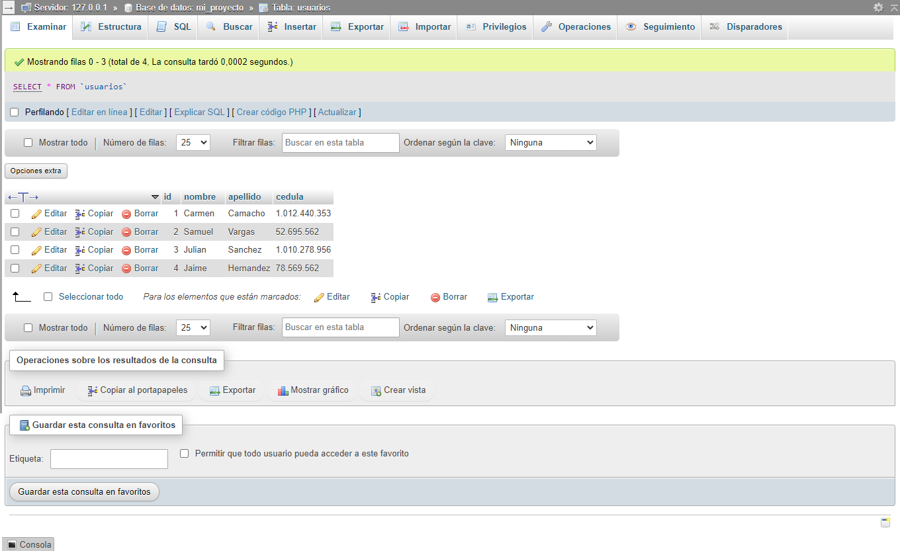
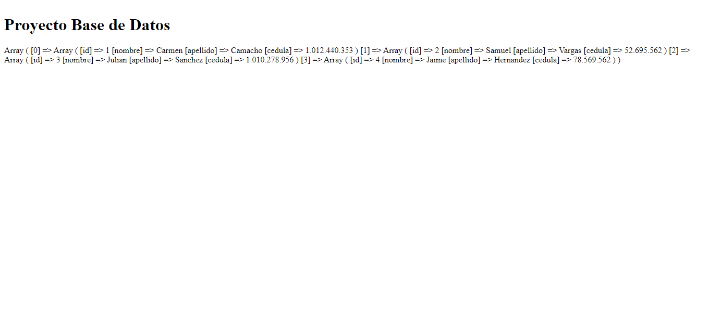
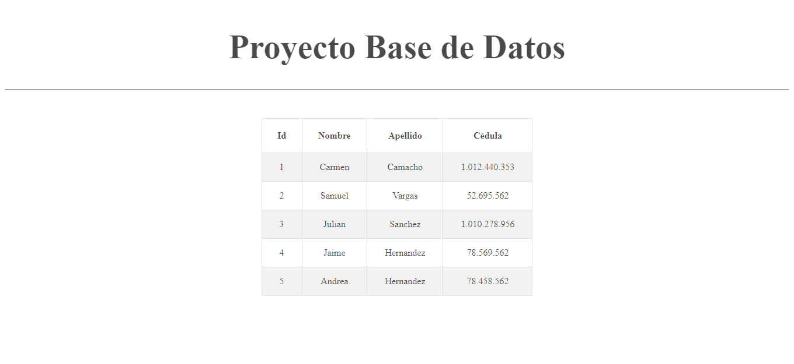

<h1>Taller 10: Carmen Camacho</h1>

<h2>Información</h2>

Curso:Full Stack Básico - Grupo 1

Profesor: Cristian Felipe Patiño

<h2>Punto: 1: </h2>

<h2>Punto: 2: </h2>

<h2>Punto: 3: </h2>

<h2>Punto: 4: </h2>

<h2>Punto: 5-6-7: </h2>

<h3>5- Base de Datos</h3>

<h3>6- Conexión</h3>

<h3>7- Mustra de Datos en Pantalla</h3>

