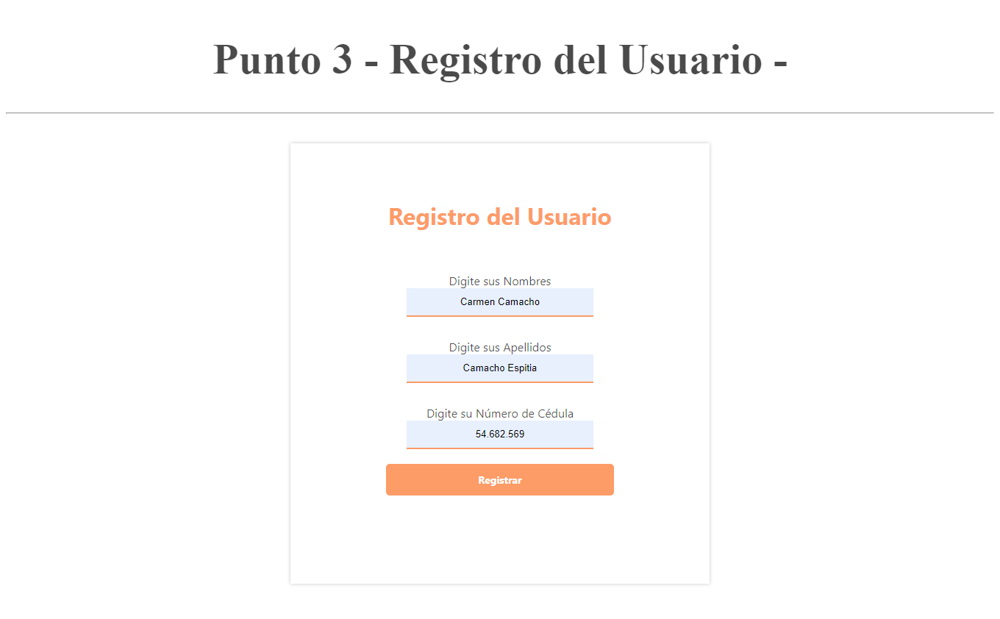

<h1>Taller 10: Carmen Camacho</h1>

<h2>Información</h2>

Curso:Full Stack Básico - Grupo 1

Profesor: Cristian Felipe Patiño

<h2>Punto: 1: Operaciones de dos Números</h2>

<h2>Punto: 2: Calculo de Mayoría de Edad</h2>

<h2>Punto: 3: Paso de Datos del Usuario</h2>

<h2>Punto: 4: Calculo de Mayoría de Edad con Fechas</h2>

<h2>Punto: 5-6-7: Proyecto de Conexión Base de Datos</h2>

<h3>5- Base de Datos</h3>

<h3>6- Conexión</h3>

<h3>7- Muestra de Datos en Pantalla</h3>

